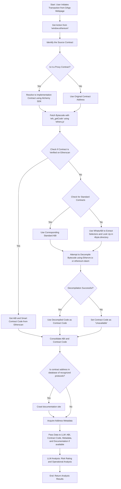

# tx-clearsigner backend

A Node.js TypeScript Express backend for analyzing Ethereum transactions and smart contracts using Alchemy SDK and Prisma ORM.

## Architecture Overview



## Tech Stack

- **Runtime**: Node.js 18+
- **Language**: TypeScript
- **Framework**: Express.js
- **Database**: PostgreSQL with Prisma ORM
- **Blockchain SDK**: Alchemy SDK
- **Validation**: Zod
- **Testing**: Vitest
- **Rate Limiting**: express-rate-limit
- **Analysis Framework**: Modular plugin-based system

## Quick Start

### Easy Installation (Recommended)

```bash
./install.sh
```

### Manual Installation

#### 1. Install Dependencies

```bash
npm install
```

#### 2. Environment Setup

Copy the environment template and fill in your API keys:

```bash
cp .env.example .env
```

Required environment variables:
- `DATABASE_URL`: PostgreSQL connection string
- `ALCHEMY_API_KEY`: Your Alchemy API key
- `ETHERSCAN_API_KEY`: Your Etherscan API key

Optional environment variables:
- `DEBUG`: Set to `true` to enable debug logging
- `RATE_LIMIT_MAX_REQUESTS`: Maximum requests per window (default: 100)
- `RATE_LIMIT_ANALYSIS_MAX`: Maximum analysis requests per window (default: 10)

#### 3. Database Setup

```bash
# Generate Prisma client
npm run db:generate

# Push schema to database (for development)
npm run db:push

# Or run migrations (for production)
npm run db:migrate
```

#### 4. Start Development Server

```bash
npm run dev
```

The server will start on `http://localhost:3001`

## API Endpoints

### Health Check
```
GET /health
```

### Transaction Analysis
```
POST /api/analysis/transaction
Content-Type: application/json

{
  "to": "0x1234567890123456789012345678901234567890",
  "data": "0x...",
  "value": "0",
  "from": "0x..."
}
```

### Analysis History
```
GET /api/analysis/history?page=1&limit=10&contractAddress=0x...
```

### Contract Information
```
GET /api/contracts/0x1234567890123456789012345678901234567890
```

### Contract Metadata
```
GET /api/contracts/0x1234567890123456789012345678901234567890/metadata
```

## Project Structure

```
src/
├── analysis/           # Modular analysis framework
│   ├── interfaces/     # Analysis interfaces and types
│   ├── modules/        # Individual analysis modules
│   │   ├── security/   # Security-focused analyses
│   │   ├── defi/       # DeFi-specific analyses
│   │   └── gas/        # Gas optimization analyses
│   ├── AnalysisManager.ts  # Analysis orchestration
│   └── registry.ts     # Module registration
├── controllers/        # Request handlers
├── middleware/         # Express middleware (auth, rate limiting, errors)
├── prisma/            # Database client
├── routes/            # API route definitions
├── services/          # Business logic
├── types/             # TypeScript types
├── utils/             # Utility functions (logger)
├── validation/        # Zod schemas
├── app.ts            # Express app setup
└── index.ts          # Server entry point
```

## Available Scripts

- `npm run dev` - Start development server with hot reload
- `npm run build` - Build for production
- `npm run start` - Start production server
- `npm run db:generate` - Generate Prisma client
- `npm run db:push` - Push schema to database
- `npm run db:migrate` - Run database migrations
- `npm run test` - Run tests
- `npm run lint` - Run ESLint

## Environment Variables

| Variable | Required | Description |
|----------|----------|-------------|
| `NODE_ENV` | No | Environment (development/production/test) |
| `PORT` | No | Server port (default: 3001) |
| `DATABASE_URL` | Yes | PostgreSQL connection string |
| `ALCHEMY_API_KEY` | Yes | Alchemy API key |
| `ALCHEMY_NETWORK` | No | Alchemy network (default: eth-mainnet) |
| `ETHERSCAN_API_KEY` | Yes | Etherscan API key |
| `CORS_ORIGIN` | No | CORS origin (default: allow all) |
| `LOG_LEVEL` | No | Log level (default: info) |
| `DEBUG` | No | Enable debug logging (default: false) |
| `RATE_LIMIT_WINDOW_MS` | No | Rate limit window in ms (default: 60000) |
| `RATE_LIMIT_MAX_REQUESTS` | No | Max requests per window (default: 100) |
| `RATE_LIMIT_ANALYSIS_MAX` | No | Max analysis requests per window (default: 10) |

## Features

### 🔒 Rate Limiting
- **General endpoints**: 100 requests per minute
- **Analysis endpoints**: 10 requests per minute (resource-intensive)
- **Read-only endpoints**: 200 requests per minute
- **Health checks**: 10 requests per 10 seconds

### 📝 Advanced Logging
- **Structured logging** with timestamps and context
- **Debug mode**: Enable with `DEBUG=true` in .env
- **Log levels**: Error (-E-), Warning (-W-), Info (-I-), Debug (-D-)
- **Contextual logging**: API requests, database queries, contract analysis

### 🔍 Modular Analysis Framework
- **Plugin-based architecture**: Easy to add new analysis modules
- **Category-based**: Security, DeFi, Gas optimization, etc.
- **Parallel execution**: Multiple analyses run concurrently
- **Weighted scoring**: Risk scores based on confidence levels
- **Dependency management**: Analyses can depend on others

#### Available Analysis Modules
- **Security**: Proxy contract analysis, upgrade mechanisms
- **DeFi**: Token standard detection (ERC-20/721/1155)
- **Gas**: Optimization opportunities, expensive patterns

#### Adding New Analysis Modules
```typescript
// Create new analysis in src/analysis/modules/
export class MyAnalysis extends BaseAnalysis {
  readonly id = 'my-custom-analysis';
  readonly name = 'My Custom Analysis';
  // ... implement required methods
}

// Register in src/analysis/registry.ts
analysisManager.register(new MyAnalysis(), {
  enabled: true,
  timeout: 10000,
  priority: 5,
});
```

## Development

### Code Style

This project follows the established code style guide:
- camelCase for files/functions
- kebab-case for folders
- Zod for validation
- Early returns and guard clauses
- Structured logging with timestamps

### Database Schema

The database includes models for:
- **Contracts**: Smart contract information and metadata
- **TransactionAnalysis**: Analysis results and risk ratings with compiled analysis data
- **Protocols**: Known protocol information

### Error Handling

Centralized error handling with:
- Custom `AppError` class
- Async handler wrapper
- Structured error responses
- Request validation with Zod

## Contributing

1. Follow the established code style guide
2. Add tests for new features
3. Update documentation as needed
4. Use conventional commit messages