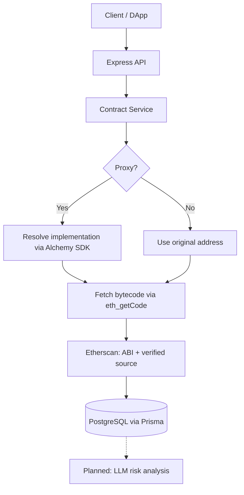

# tx-clearsigner

Express/TypeScript backend PoC for transaction "clear signing": given a contract address, it resolves proxies to implementations, fetches bytecode, ABI and verified source (Etherscan, Alchemy), and stores address, contract, tag, label and proxy-history metadata in PostgreSQL via Prisma.

> Reference code, not audited. Do not use in production without your own review.

## Architecture

Implemented today is the data-collection part (solid boxes). The LLM risk-analysis stage is **planned** and not implemented.



## Stack

Node 18+, TypeScript, Express, Prisma 5 (PostgreSQL), alchemy-sdk, ethers v6, axios, zod, helmet, cors, morgan, express-rate-limit, vitest, eslint.

## Supported chains

Seeded by `npm run db:init`: Ethereum mainnet and Sepolia, Polygon mainnet and Mumbai, Arbitrum One, Optimism, Base. The Alchemy network setting (`ALCHEMY_NETWORK`) currently accepts `eth-mainnet`, `eth-sepolia`, `polygon-mainnet`, `polygon-mumbai`.

## Setup

```bash
./install.sh            # or: npm install
cp .env.example .env    # fill in placeholders
npm run db:generate
npm run db:push
npm run db:init
npm run dev             # http://localhost:3001
```

## Environment variables

| Variable | Required | Description |
|---|---|---|
| `NODE_ENV` | No | development / production / test |
| `PORT` | No | Server port (default 3001) |
| `DATABASE_URL` | Yes | PostgreSQL connection string |
| `ALCHEMY_API_KEY` | Yes | Alchemy API key |
| `ALCHEMY_NETWORK` | No | Alchemy network (default eth-mainnet) |
| `ETHERSCAN_API_KEY` | Yes | Etherscan API key |
| `CORS_ORIGIN` | No | CORS origin (default: allow all) |
| `LOG_LEVEL` | No | error / warn / info / debug (default info) |
| `DEBUG` | No | Enable debug logging (default false) |
| `RATE_LIMIT_WINDOW_MS` | No | Rate limit window in ms (default 60000) |
| `RATE_LIMIT_MAX_REQUESTS` | No | Max requests per window (default 100) |

## API surface

- `GET /health`
- `GET /api/contracts/:address`
- `GET /api/contracts/:address/metadata`
- `POST /api/contracts/verify`
- `GET /api/addresses/search`
- `GET /api/addresses/tags`
- `GET /api/addresses/:address/:chainId`
- `POST /api/addresses`
- `POST /api/addresses/:addressId/tags`
- `POST /api/addresses/:addressId/labels`
- `POST /api/addresses/:addressId/metadata`

**Security note:** the write endpoints (`POST /api/addresses*`) have **no authentication**, and CORS defaults to allow-all. Run this service behind network-level protection (private network, VPN, or authenticating reverse proxy).

Rate limits: general 100 req/min, read-only 200 req/min, health 10 req/10 s (tunable through env).

## Planned (not implemented)

- Transaction analysis endpoints (`/api/analysis/*`) and a modular analysis framework
- LLM-based risk rating and operational analysis
- Documentation crawling for recognised protocols

## Known issues

- No test suite is included beyond the vitest setup.
- `npx tsc --noEmit` reports pre-existing type errors (e.g. `alchemyService.getContractMetadata` missing on the SDK core namespace, nullable JSON inputs in `contractService`); the `dev` script runs via tsx.
- `prisma/migrations/` is git-ignored; use `db:push` for development.

## Context

Built in mid-2025 as an exploratory proof of concept for clear signing of Ethereum transactions.

## Breaking changes from the original private repo

Renamed for this release: package name `tx-clearsigner` (was a product-specific name), health endpoint message, install script and log strings. Anything matching on the old package name or health message must be updated.

## License

MIT, see `LICENSE`. No third-party licensed code is vendored.
